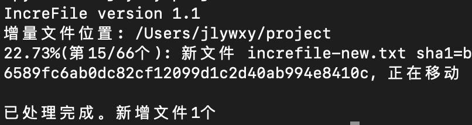

# IncreFile
增量备份/文件去重实用工具【自用】<br>
版本: 1.1 (211028)<br>
作者: jlywxy (jlywxy@outlook.com)<br><br>
<br><br>
## 概述
本程序计算每个文件的sha1值并建立列表，将增量文件的sha1值与列表比对，从而判断文件是已经存在的文件还是增加的新文件。

## 使用方法
shell
```shell
> python3 merge.py $增量文件夹路径
```
若第一次使用，程序将在$pwd下创建destination文件夹存放增量文件，并将列表保存为shalist.txt以供下次比对使用。shalist.txt中记录的sha1值将完全对应destination中的每一个文件。<br>
否则，程序以destination中的文件作为基准对增量文件进行比对
## 特性
程序每比对一次文件后立即移动文件、更新列表，并立即写入列表文件。
因此当程序异常中止或接收到SIGINT(Control-C)时之前的比对进度不会消失。(python hashlib和文件io效率较高，因此上述立即操作并不过多影响性能。)
并且，操作过程中多占用的磁盘空间仅仅为比对文件大小最大值+shalist.txt的大小，适用于磁盘空间不足情况下使用。


